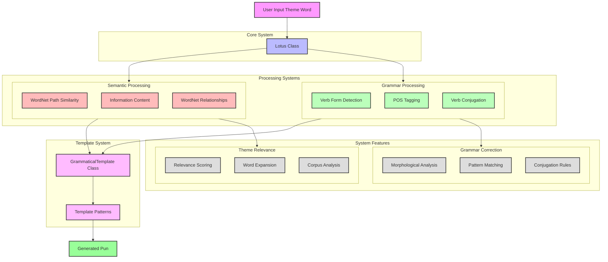

# Pun Generator System Architecture

This diagram shows how the pun generation system works, including the main components and their interactions.

## System Architecture

### 1. Input Layer
- **User Input**: Theme word processing and validation
- **Input Normalization**: Standardization of input format

### 2. Core System
- **Lotus Class**: Main orchestrator for pun generation
  - Coordinates between processing systems
  - Manages theme word processing
  - Handles compound word generation

### 3. Processing Systems
#### Semantic Processing
- **WordNet Integration**: Path similarity calculations
- **Information Content**: Corpus-based frequency analysis
- **WordNet Relationships**: Hypernyms, hyponyms, and meronyms

#### Grammar Processing
- **Verb Form Detection**: Automatic verb identification
- **POS Tagging**: Part-of-speech analysis
- **Verb Conjugation**: Morphological rules application

### 4. Template System
- **GrammaticalTemplate Class**: Core template management
- **Template Patterns**: Pun structure and formatting
- **Grammar Integration**: Applies corrections to templates

### 5. System Features
#### Theme Relevance
- **Relevance Scoring**: Semantic similarity metrics
- **Word Expansion**: Related word discovery
- **Corpus Analysis**: Frequency and usage patterns

#### Grammar Correction
- **Morphological Analysis**: Word form processing
- **Pattern Matching**: Template-based corrections
- **Conjugation Rules**: Verb form generation

## Data Flow

1. **Input Processing**
   - User provides theme word
   - System validates and normalizes input

2. **Core Processing**
   - Lotus class coordinates generation
   - Semantic and grammar systems process input

3. **Template Processing**
   - Template system applies corrections
   - Patterns are selected and formatted

4. **Feature Application**
   - Theme relevance ensures context
   - Grammar correction ensures correctness

5. **Output Generation**
   - Final pun is formatted
   - Output is grammatically correct and theme-relevant

## Key Features

### Theme Relevance
- Multi-method semantic similarity
- WordNet relationship expansion
- Corpus-based frequency analysis

### Grammar Correction
- Automatic verb form detection
- Morphological analysis
- Pattern-based corrections

### Performance
- Caching system
- Early termination
- Batch processing 